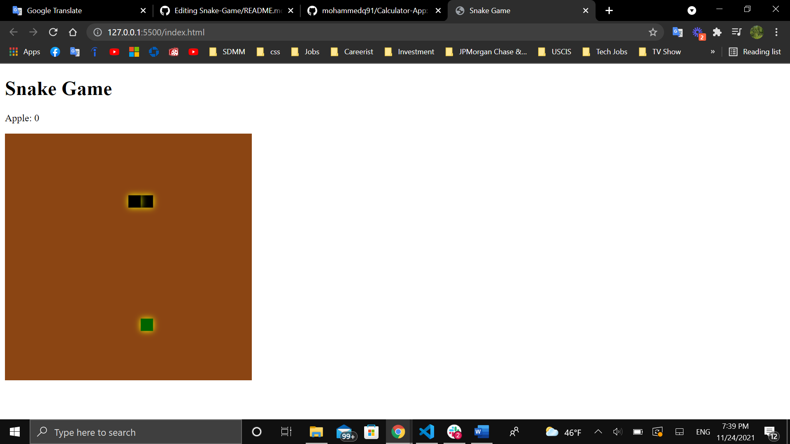

# Snake Game
#### Snake game written in Javascript, HTML, and CSS.
#### Play it [here](http://127.0.0.1:5500/index.html)

## Summary
The Snake Game was fun project to develop that allowed me to further work on my basic Javascript skills. The project has several involved challenges where I had to tweak by experimenting with various data types to make it work and to overcome each challenge one at a time.
 in which I learned the following:
- Objects creation and manipulate the objects via accessing its properities.
- Programming logic.
- Draw objects on canvas.
- Conditional statements.
- Listening to keyboard events. 

## Author

-**Mohammed Qaralos** -*Self taught Software Developer* - [LinkedIn](https://www.linkedin.com/in/mohammed-qaralos-27151010a/)
